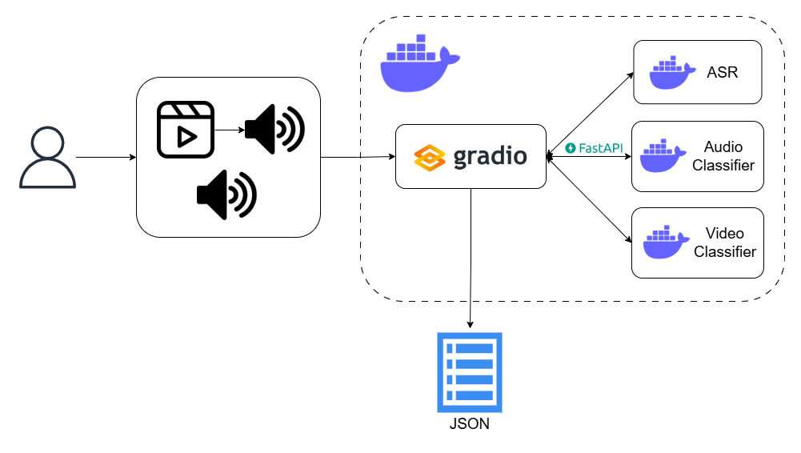

# 🐦‍⬛ RAVEN: Recognition of Audio-Visual Emotional Nuances

RAVEN is a multimodal system for recognizing emotional nuances in both audio and video streams in Russian. The project leverages pretrained open-source models for text transcription and audio and video emotion recognition for further recording analysis, all wrapped in an interactive mircoservice app with Gradio web interface.

---

---

## 🌟 Features

- **STT**: Get text transcription from audio or video.
- **Emotion Recognition**: Extract emotional cues from both audio and video using state-of-the-art pretrained open-source models.  
- **Interactive UI**: Gradio-powered interface for real-time emotion detection.  
- **Scalable Microservice Architecture**: Easily extendable if needed to use other models via FastAPI and Docker Compose.

---

## 📋 Prerequisites

- Python 3.11
- [Docker](https://www.docker.com/) and [Docker Compose](https://docs.docker.com/compose/) for containerized setup  
- A Hugging Face API token (stored in `.env` file)  

---

## 🚀 Quickstart 

More about project deployment can be read [here](project/README.md).

## 📫 Contact
For questions or collaboration ideas, feel free to reach out via GitHub Issues.
